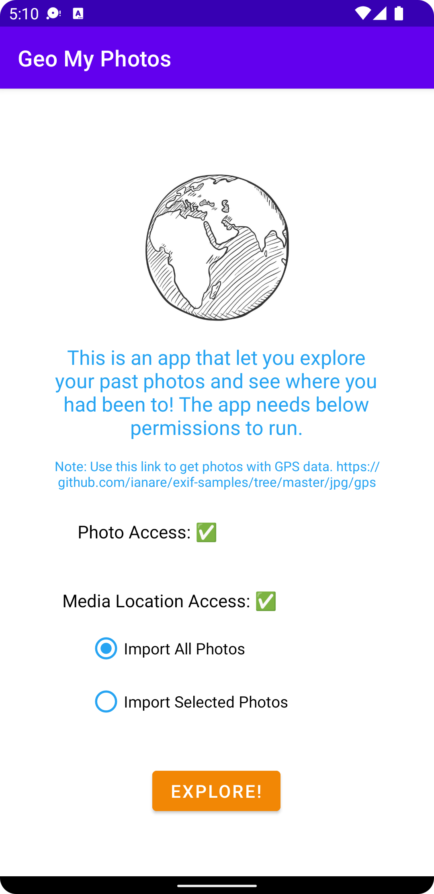
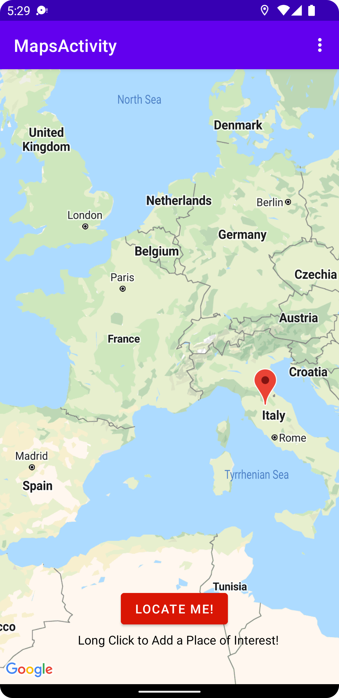
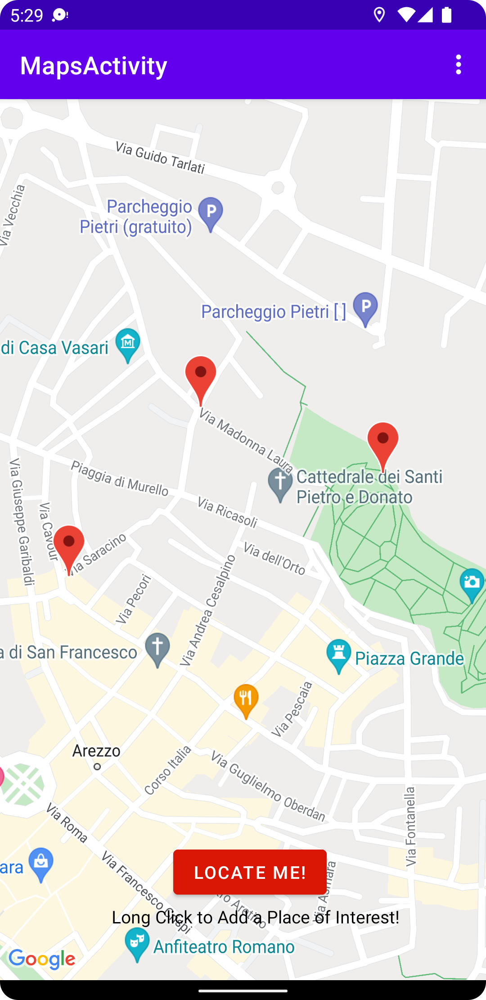
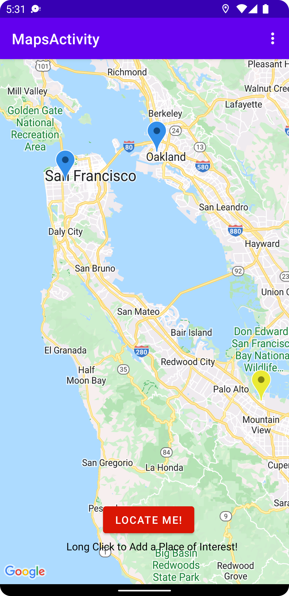

# GeoPhotos

## About
Exchangeable image file format (EXIF) is a standard that specifies the formats for images, sound, and ancillary tags used by digital cameras (including smartphones), scanners and other systems handling image and sound files recorded by digital cameras.
Photos taken with EXIF data preserved can be very useful for its users. One such type of EXIF data is the latitudinal and longitudinal value of the location where the photo is taken.
This app reads such data from stored photos and display the location pins across Google Map so that users can quickly glance the locations easily.
This app also expands to include adding desired locations along with past visited locations, making this app a great travel companion.

## Screenshots
 
 

